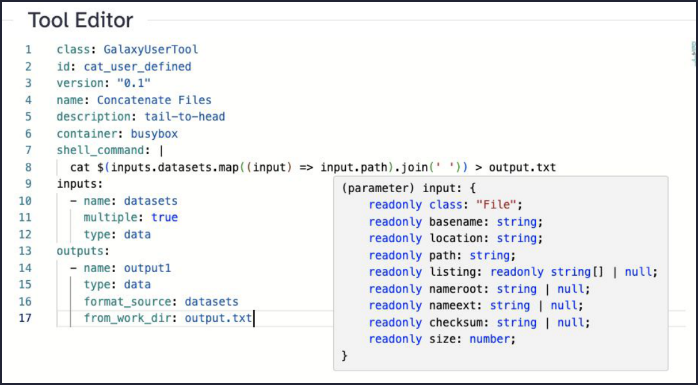
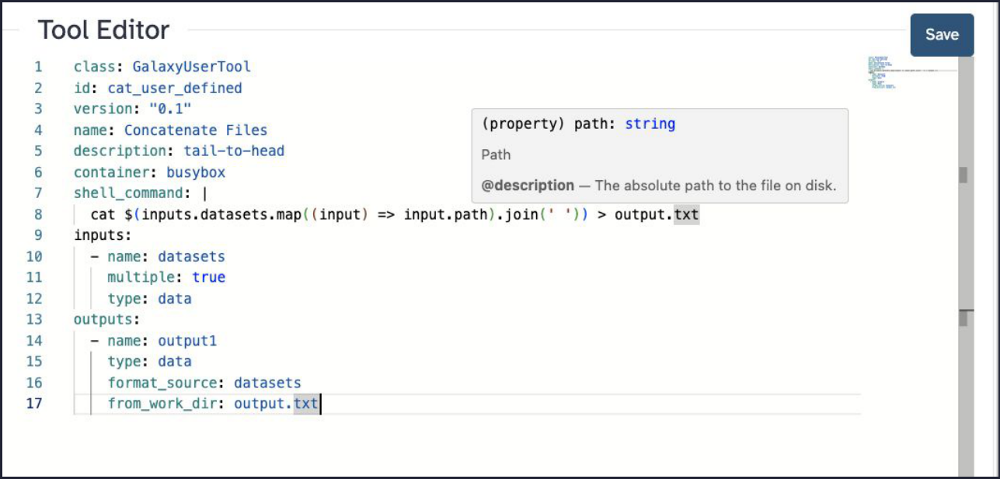
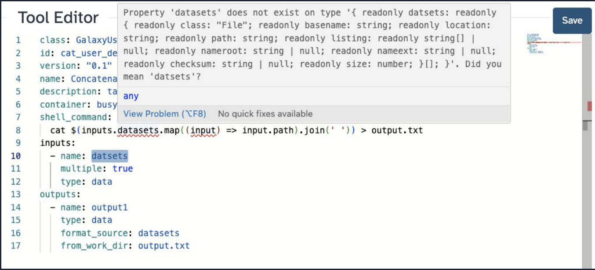

# Galaxy Tools 2.0 — Bring your own!

*Converted from `User defined tools.pptx` / `User defined tools (1).pdf`. Code transcribed from the slide screenshots.*


---

## Slide 1: Galaxy Tools 2.0

**Bring your own!**


Marius van den Beek  
PSU / SCI-SCALE  
marius@galaxyproject.org  

---

## Slide 2: Why can’t users install tools?

- We don’t want to limit what you can do!
  - I need “xyz” and it’s not on the server I use, help please?
- You can already run code with RStudio and Jupyter*
- We can isolate storage and compute

---

## Slide 3: Why can’t users install tools?

---

## Slide 4: Templating with Cheetah

```xml
<tool id="cat" version="0.1">
    <description>tail-to-head</description>
    <requirements>
        <requirement type="container">busybox</requirement>
    </requirements>
    <command><![CDATA[
cat
#for dataset in datasets:
    '$dataset'
#end for
> '$output1'
    ]]></command>
    <inputs>
        <input name="datasets" format="data" type="data" multiple="true"/>
    </inputs>
    <outputs>
        <output name="output1" format_source="datasets" />
    </outputs>
</tool>
```
*Classic Galaxy tool — Cheetah loop over inputs*

---

## Slide 5: Templating with Cheetah 🎃

> **The catch:** Cheetah templates are evaluated as arbitrary Python while the job command is built — so a tool author can read the database, touch the filesystem, do anything. That’s exactly why users can’t be allowed to install tools.

```xml
<command><![CDATA[
    #from pathlib import Path
    #user_id = $__app__.model.session().query($__app__.model.User.id).one()
    #open(f"{Path.home()}/a_file", "w").write("Hello!")
]]></command>
```
*Nothing stops a template from running this*

---

## Slide 6: How do we manage 1000s of tools?


*galaxyproject/tools-iuc — 337 open / 5,450 closed pull requests. Every tool is hand-curated and reviewed.*

---

## Slide 7: There has to be a better way!

---

## Slide 8: Javascript expressions & JSON inputs

```yaml
class: GalaxyUserTool
id: cat_user_defined
version: "0.1"
name: Concatenate Files
description: tail-to-head
container: busybox
shell_command: |
  cat $(inputs.datasets.map((input) => input.path).join(' ')) > output.txt
inputs:
  - name: datasets
    multiple: true
    type: data
outputs:
  - name: output1
    type: data
    format_source: datasets
    from_work_dir: output.txt
```
*A user-defined tool — values come from a sandboxed JS expression*

---

## Slide 9: Javascript expressions & JSON inputs

```yaml
class: GalaxyUserTool
id: cat_user_defined
version: "0.1"
name: Concatenate Files
description: tail-to-head
container: busybox
shell_command: |
  cat $(inputs.datasets.map((input) => input.path).join(' ')) > output.txt
inputs:
  - name: datasets
    multiple: true
    type: data
outputs:
  - name: output1
    type: data
    format_source: datasets
    from_work_dir: output.txt
```
*Tool definition*

```javascript
var inputs = {
    "datasets": [
        {
            "class": "File",
            "location": "step_input://1",
            "format": "csv",
            "path": "/Users/mvandenb/src/galaxy/databa…",
            "basename": "markers.csv",
            "nameroot": "markers",
            "nameext": ".csv"
        }
    ],
    "chromInfo": "/tmp/shared/ucsc/chrom/?.len",
    "dbkey": "?",
    "__input_ext": "input"
};
```
*The inputs object the expression evaluates against (path truncated)*

---

## Slide 10: Javascript expressions & JSON inputs

```yaml
class: GalaxyUserTool
id: cat_user_defined
version: "0.1"
name: Concatenate Files
description: tail-to-head
container: busybox
shell_command: |
  cat $(inputs.datasets.map((input) => input.path).join(' ')) > output.txt
inputs:
  - name: datasets
    multiple: true
    type: data
outputs:
  - name: output1
    type: data
    format_source: datasets
    from_work_dir: output.txt
```
*Tool Editor*

> **Autocomplete:** In the editor, Monaco knows the inferred type of input inside the expression and offers autocomplete:

```typescript
(parameter) input: {
    readonly class: "File";
    readonly basename: string;
    readonly location: string;
    readonly path: string;
    readonly listing: readonly string[] | null;
    readonly nameroot: string | null;
    readonly nameext: string | null;
    readonly checksum: string | null;
    readonly size: number;
}
```


*The live Tool Editor showing the autocomplete popup*

---

## Slide 11: Javascript expressions & JSON inputs

> Same view as the previous slide (presenter build step).


*Tool Editor with type-aware autocomplete*

---

## Slide 12: Monaco + YAML schemas

> **Hover docs:** Hovering a property in the YAML surfaces documentation pulled from the schema:

```text
(property) path: string
Path
@description — The absolute path to the file on disk.
```


*Monaco hover tooltip driven by the YAML schema*

---

## Slide 13: Monaco + Typescript interfaces

> **Type checking:** Typos in the expression are caught as real TypeScript errors, with suggestions:

```text
Property 'datsets' does not exist on type '{ readonly datasets: readonly
{ readonly class: "File"; readonly basename: string; readonly location:
string; readonly path: string; readonly listing: readonly string[] |
null; readonly nameroot: string | null; readonly nameext: string | null;
readonly checksum: string | null; readonly size: number; }[]; }'.
Did you mean 'datasets'?
```


*TypeScript error shown inline in the Tool Editor*

---

## Slide 14: Behind the scenes

- Tool parameters are modeled as Pydantic models
  - As a general schema that describes “A Galaxy Tool”
  - As a specialized schema for “This Galaxy Tool’s Potential Input Object”
- Pydantic models are transformed to JSON schema
- JSON schema is transformed to a TypeScript interface for runtime inputs
- Monaco Editor renders the tool source
  - Knows what to do with the YAML schema for the tool
  - Understands the TypeScript interface and compares it to the code in JavaScript fragments

---

## Slide 15: Behind the scenes

---

## Slide 16: Generated JSON schema — inputs

```json
"inputs": {
    "additionalProperties": false,
    "properties": {
        "datasets": {
            "items": {
                "$ref": "#/components/schemas/DataInternalJson"
            },
            "title": "Datasets",
            "type": "array"
        }
    },
    "required": [
        "datasets"
    ],
```
*Top-level inputs schema (excerpt)*

---

## Slide 17: Generated JSON schema — inputs

> Same schema as the previous slide (presenter build step).

```json
"inputs": {
    "additionalProperties": false,
    "properties": {
        "datasets": {
            "items": {
                "$ref": "#/components/schemas/DataInternalJson"
            },
            "title": "Datasets",
            "type": "array"
        }
    },
    "required": [
        "datasets"
    ],
```
*Top-level inputs schema (excerpt)*

---

## Slide 18: Generated JSON schema — DataInternalJson

```json
"DataInternalJson": {
    "additionalProperties": false,
    "properties": {
        "class": {
            "const": "File",
            "title": "Class",
            "type": "string"
        },
        "basename": {
            "description": "The base name of the file, that is, the nam…",
            "title": "Basename",
            "type": "string"
        },
        "location": {
            "title": "Location",
            "type": "string"
        },
        "path": {
            "description": "The absolute path to the file on disk.",
            "title": "Path",
            "type": "string"
        },
    }
}
```
*The File schema referenced by inputs (excerpt; some descriptions truncated)*

---

## Slide 19: Enabling User-Defined Tools

> To enable this feature:

1. Set enable_beta_tool_formats: true in your Galaxy configuration.
2. Create a role of type Custom Tool Execution in the admin user interface.
3. Assign users or groups to this role.

---

## Slide 20: Sharing User-Defined Tools

User-defined tools are private to their creators. However, if a tool is embedded in a workflow, any user who imports that workflow will automatically have the tool created in their account.

These tools can also be exported to disk and loaded like regular tools, enabling instance-wide availability if needed.

---

## Slide 21: Sharing User-Defined Tools

> Same content as the previous slide (presenter build step).

User-defined tools are private to their creators. However, if a tool is embedded in a workflow, any user who imports that workflow will automatically have the tool created in their account.

These tools can also be exported to disk and loaded like regular tools, enabling instance-wide availability if needed.

---

## Slide 22: Limitations

The user-defined tool language is still evolving, and additional safety audits are ongoing.

Current limitations include:

- Access to reference data is not supported
- Access to metadata and metadata files (such as BAM indexes) is not supported
- Access to the extra_files directory is not supported

---

## Slide 23: Coming to a server near you soon!

```yaml
class: GalaxyUserTool
id: thank-you
version: "1.0"
name: Thank You!
description: Bring your own gratitude
container: busybox
shell_command: |
  echo "Thank you John Chilton, Dannon Baker, Michael Crusoe,
  Anton Nekrutenko, Nicola Soranzo and the audience at GCC!" > thanks.txt
outputs:
  - name: output1
    type: data
    from_work_dir: thanks.txt
```
*One last user-defined tool*

With gratitude 💜  
