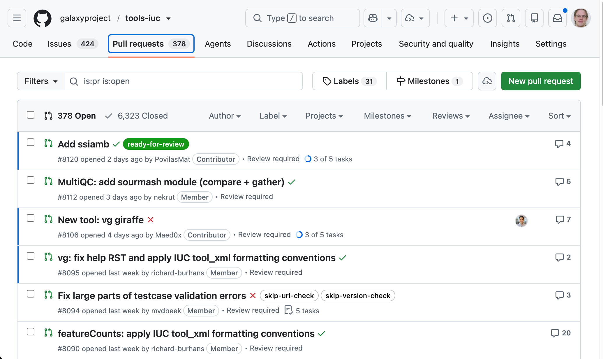
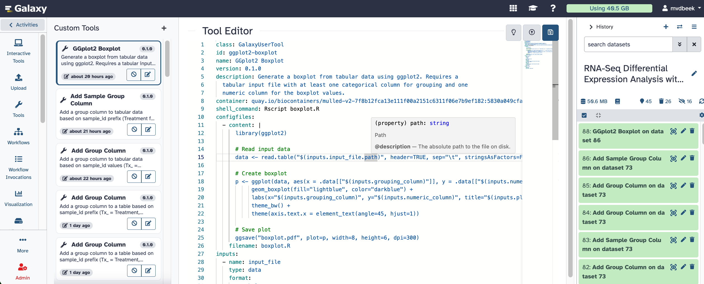
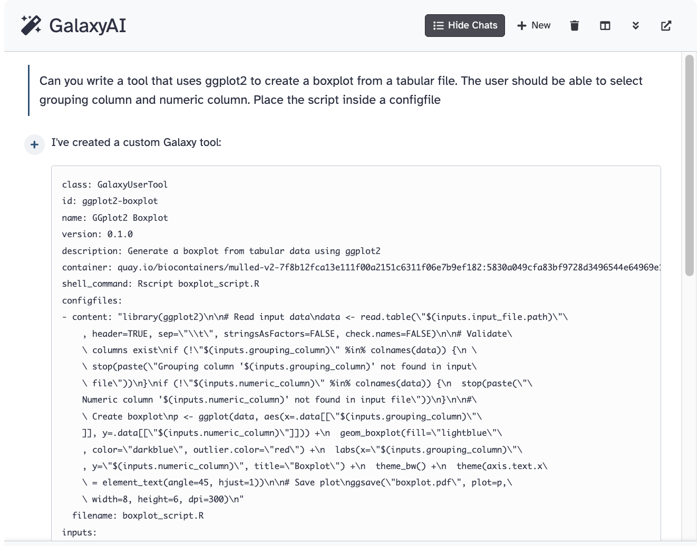

# User-Defined Tools — From LLM Code to Validated Workflows

*Source of truth for the deck. Edit this file, then run `python3 build.py` to regenerate `slides.html`. See `build.py` for the small set of Markdown conventions used below.*

---

## Slide 1: User-Defined Tools {.title}

**Bring your own!**

From throwaway LLM code → reproducible, validatable workflows

::: meta
Marius van den Beek
PSU / SCI-SCALE
marius@galaxyproject.org
:::

---

## Slide 2: From users to tool authors {.section}

Lower the barrier, grow the community — Accessible · Reproducible · Transparent

---

## Slide 3: The catch — a tool is arbitrary code

> [!WARN] **The catch:** A classic Galaxy tool’s command is a Cheetah template — evaluated as **arbitrary Python** while the job is built. A tool author can read the database, touch the filesystem, do anything. That’s exactly why users can’t be allowed to install tools.

```xml {hl=2-4}
<command><![CDATA[
    #from pathlib import Path
    #user_id = $__app__.model.session().query($__app__.model.User.id).one()
    #open(f"{Path.home()}/a_file", "w").write("Hello!")
]]></command>
```
*Nothing stops a classic tool template from running this*

---

## Slide 4: Curation is a strength — good tools make good workflows


*galaxyproject/tools-iuc: thousands of carefully reviewed tools — one of Galaxy’s greatest strengths. Trusted, reproducible tools are exactly what make trusted, reproducible workflows.*

> **A high bar by design:** not every need fits it:  one-off, exploratory, “I need xyz, right now.” That gap is what user-defined (glue) tools fill.

---

## Slide 5: The answer — User-Defined Tools

```yaml {hl=8-18}
class: GalaxyUserTool
id: ggplot2-boxplot
name: GGplot2 Boxplot
version: "0.1.0"
description: Boxplot from tabular data — a grouping column and a numeric column
container: quay.io/biocontainers/mulled-v2-7f8b12fca13e111f00a2151c6311f06e7b9ef182:5830a049cfa83bf9728d3496544e64969e1ef789-0
shell_command: Rscript boxplot.R
configfiles:
  - filename: boxplot.R
    content: |
      library(ggplot2)
      data <- read.table("$(inputs.input_file.path)", header=TRUE, sep="\t")
      ggplot(data, aes(x = .data[["$(inputs.grouping_column)"]],
                       y = .data[["$(inputs.numeric_column)"]])) +
        geom_boxplot(fill="lightblue", color="darkblue") +
        labs(title="$(inputs.plot_title)") +
        theme_bw()
      ggsave("boxplot.pdf", width=8, height=6, dpi=300)
inputs:
  - {name: input_file, type: data, format: tabular}
  - {name: grouping_column, type: text}
  - {name: numeric_column, type: text}
  - {name: plot_title, type: text}
outputs:
  - {name: plot, type: data, format: pdf, from_work_dir: boxplot.pdf}
```
*Anatomy of a User-Defined Tool: typed inputs, a pinned container, and the R script itself in a `configfile` — safe to build and run yourself, no XML and no arbitrary Python. For the personal and the exploratory; curated tools stay the backbone. (Our running example.)*

---

## Slide 6: …and the editor makes it safe and pleasant

> **Typed, in the browser:** Monaco knows the inferred type of `inputs.*` from the tool’s schema — offering autocomplete, hover docs, and real TypeScript errors on the expressions, before anything runs.


*The live Tool Editor — the same boxplot tool: type-aware hover docs and inline errors, driven by the generated schema*

---

## Slide 7: Why we built this — iterate against the real thing

- Building a fully curated tool is thorough — write XML, build a container, open a PR, review — the right bar for a production tool, but a lot to go through just to find out *“is this even the tool I want?”*
- User-defined tools turn that into a live loop, right where your data is:
  - **Is this even the tool I want?** — try it, look at the output, change it
  - **Get the first shot right** — a tight edit → run → inspect cycle
  - **Test against real resources** — real datasets and real compute: GPUs, more memory, the cluster it’ll actually run on
- Humans need this — and agents and LLMs need it even more
  - try → run → inspect → fix is exactly how an agent converges on a tool that works

---

## Slide 8: …and ask for the resources you need

```yaml {hl=2-8}
container: quay.io/biocontainers/foldseek:10.941cd33
requirements:
  - type: resource
    cores_min: 32
    ram_min: 8192            # MB
    gpu_memory_min: 1
    cuda_device_count_min: 0.5
    cuda_device_count_max: 1
shell_command: |
  foldseek easy-cluster "$(inputs.seqs.path)" out tmp \
    --gpu 1 --threads "$GALAXY_SLOTS"
```
*A real GPU tool (Foldseek + ProstT5 structural clustering). The `resource` block feeds Total Perspective Vortex (TPV), which schedules the job onto a node that actually has the cores, memory, and GPU — so you prototype against the hardware you’ll really run on.*

---

## Slide 9: Your LLM code, made reproducible {.section}

---

## Slide 10: LLMs write great throwaway code

- Everyone is generating analysis code with an LLM
  - …a pandas snippet, an R plot, a one-off filter
- But the output is **ephemeral**: a chat message, a copied cell
  - hard to re-run, hard to share, impossible to reproduce six months later
- A User-Defined Tool is the natural package for it
  - structured inputs · typed parameters · a pinned container
  - → a throwaway snippet becomes a recomputable, workflow-embeddable component

---

## Slide 11: So let’s not write it by hand

> [!WARN] **Live demo:** “Write a tool that uses ggplot2 to create a boxplot from a tabular file. The user should select a grouping column and a numeric column. Put the R script in a configfile.”


*GalaxyAI (shipped as a FastMCP server) — or Claude / Orbit over MCP + a skill — authors the User-Defined Tool, multi-step, from that one sentence*

---

## Slide 12: The agent writes it — typed, not trusted blindly

```yaml {hl=12-14,16}
class: GalaxyUserTool
id: ggplot2-boxplot
name: GGplot2 Boxplot
version: "0.1.0"
description: Boxplot from tabular data — a grouping column and a numeric column
container: quay.io/biocontainers/mulled-v2-7f8b12fca13e111f00a2151c6311f06e7b9ef182:5830a049cfa83bf9728d3496544e64969e1ef789-0
shell_command: Rscript boxplot.R
configfiles:
  - filename: boxplot.R
    content: |
      library(ggplot2)
      data <- read.table("$(inputs.input_file.path)", header=TRUE, sep="\t")
      ggplot(data, aes(x = .data[["$(inputs.grouping_column)"]],
                       y = .data[["$(inputs.numeric_column)"]])) +
        geom_boxplot(fill="lightblue", color="darkblue") +
        labs(title="$(inputs.plot_title)") +
        theme_bw()
      ggsave("boxplot.pdf", width=8, height=6, dpi=300)
inputs:
  - {name: input_file, type: data, format: tabular}
  - {name: grouping_column, type: text}
  - {name: numeric_column, type: text}
  - {name: plot_title, type: text}
outputs:
  - {name: plot, type: data, format: pdf, from_work_dir: boxplot.pdf}
```
*The agent produced exactly this. Every `$(inputs.*)` in the R script is type-checked by Monaco against the tool’s schema — generated code that doesn’t type-check never runs.*

---

## Slide 13: From my tool to our tool {.section}

---

## Slide 14: Good tools should converge, not multiply

- Freedom to create has a failure mode: **duplication**
- Imagine 100 users each building their own slightly-different `bwa` wrapper
  - none reviewed, tested, or annotated — and they all drift apart
  - reproducibility and trust quietly erode
- The fix isn’t to forbid personal tools — it’s to give the good ones a path to **converge**

---

## Slide 15: Sharing — what works today

User-defined tools are **private to their creator**. But they already travel:

- Embed one in a **workflow** — anyone who imports the workflow gets the tool created in their account
- **Export to disk** and load it like a regular tool — instance-wide availability when you want it

*Great for “me” and “my lab”. But there’s nothing between a private tool and a fully curated IUC toolshed tool.*

---

## Slide 16: Proposal — a graduated promotion path

A tool should earn trust *and reach* incrementally, so good tools **converge** instead of duplicating:

1. **Personal** — create and iterate; just you
2. **Shared** — rides along in workflows / export to disk; passes static validation
3. **Project** — adopted into a **GitHub repo with CI** (tests + lint on every change); reviewed and annotated — for a lab or community project
4. **IUC → Tool Shed** — once it proves generally useful: promoted to the **IUC** and published on the **Tool Shed** as a curated, globally available tool

> Each step adds review, testing, and reach — without the full toolshed overhead up front. Full proposal in `promotion-path.md`.

---

## Slide 17: Check the workflow before you run it {.section}

---

## Slide 18: Validation in three layers — all run today, no runtime

- **Static schema** — generated JSON Schema
  - every input/output type-checks; outputs line up with the inputs they feed
- **Pydantic validators** — the params *are* Pydantic models
  - value & cross-field rules (a cutoff in range; `grouping_column` ≠ `numeric_column`); wiring across the workflow
- **Linter** — lives in `galaxy-tool-util`
  - the *same* engine that already powers the editor’s errors — annotations, deprecations, missing tests

---

## Slide 19: Proposal — expose it through planemo

Inputs and outputs are formally typed, so a workflow of UDTs is a **portable artifact** you can validate anywhere — in a repo, in CI, with no Galaxy server:

```console
$ planemo validate workflow.gxwf.yml
✗ filter step:  'numeric_column' references a column not produced upstream
✗ boxplot step: 'grouping_column' equals 'numeric_column'  (model validator)
⚠ boxplot step: tool has no test case                  (lint)

# …fix…

$ planemo validate workflow.gxwf.yml
✓ schema · ✓ validators · ✓ lint — valid, no Galaxy runtime required
```
*The same three layers, surfaced outside Galaxy. Full proposal in `workflow-validation.md`.*

---

## Slide 20: Getting access — today and what’s next

- **Access is an administrator decision** — UDTs are enabled per instance, then granted per user or role
- **Gated for now** — while the feature matures, ask us for access on the public instances
- **Opening up soon** — broader, more self-serve access is on the way
- **Bring your own compute** *(in progress)* — run UDTs on compute *you* bring, easing the resource and trust concerns that make some admins cautious

---

## Slide 21: Coming to a server near you soon! {.closing}

```yaml
class: GalaxyUserTool
id: thank-you
version: "1.0"
name: Thank You!
description: Bring your own gratitude
container: busybox
shell_command: |
  echo "Thank you John Chilton, Dannon Baker, Michael Crusoe,
  Nicola Soranzo, Anton Nekrutenko, and the audience at GCC!" > thanks.txt
outputs:
  - name: output1
    type: data
    from_work_dir: thanks.txt
```
*One last user-defined tool*

::: meta
Bring Your Own Tools!
:::
